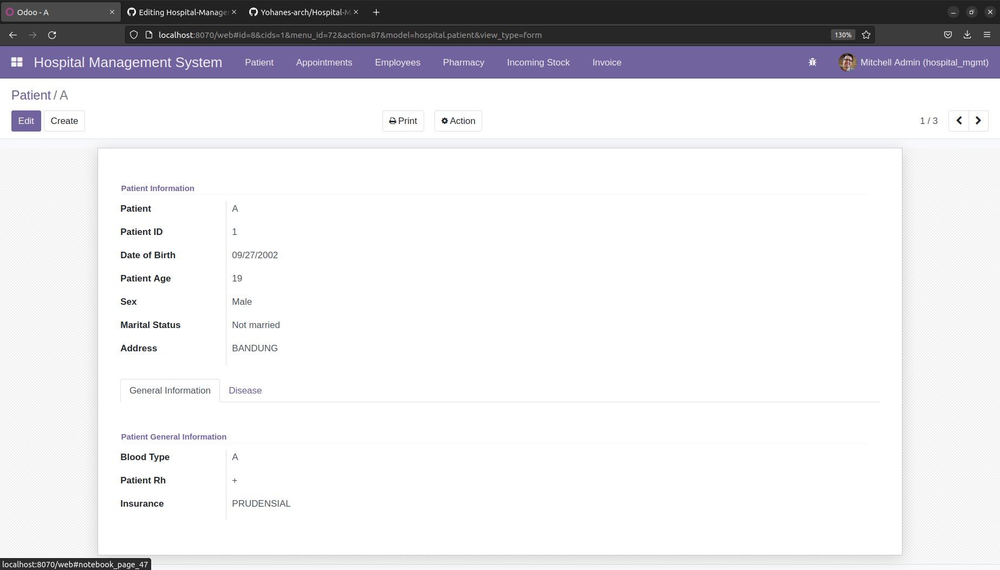

# Hospital-Management-System-Odoo

This is hospital management system module made by me using odoo. This module will handle some of the hospital management system functionalities like patient form, patient prescription, patient invoice, patient medicament, doctors appointment, employee form and list (including doctor list), medicament form, incoming stock wizard, and invoice wizard. 

## Getting Started

This repository contains the main module for hospital management system and the report module for printing report using with output `*xlsx`

* `hospital_management`
* `report_xlsx`

All the menus:

1. Patient menu's
2. Appointments menu's
3. Eemployees menu's
4. Pharmacy menu's
5. Incoming stock menu's
6. Invoice

Screenshots Preview

